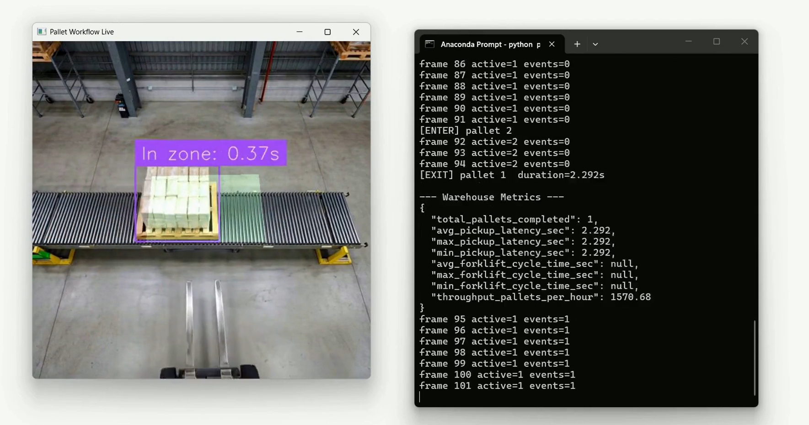
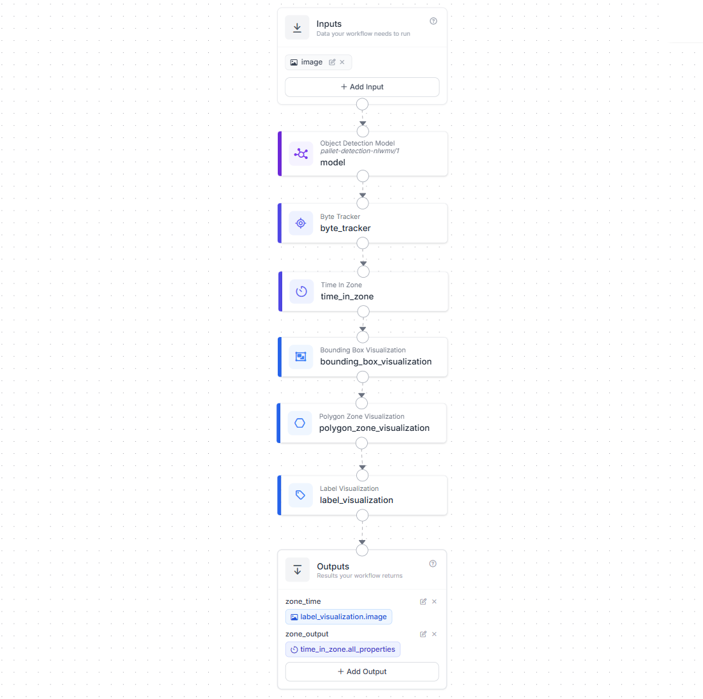
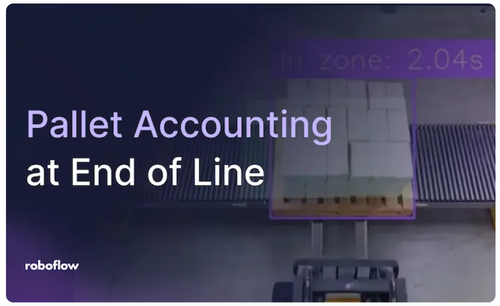

# Automated Pallet Accounting at End-of-Line with Roboflow

A computer vision system that tracks pallets at the end of a production line, recording when each pallet enters and leaves the staging zone. Built with [Roboflow](https://roboflow.com) Workflows, RF-DETR, and ByteTrack.



## What It Does

A camera watches the end-of-line staging zone. The system detects every pallet and tracks it with a persistent ID. When a pallet enters the zone, it logs a **completion event**. When a forklift picks it up and it disappears from the zone, it logs a **collection event**. The result is a timestamped ledger of every pallet that passed through the zone, plus warehouse KPIs computed in real time.

```
Camera / Video File
       │
Roboflow Workflow (RF-DETR + ByteTrack + Time in Zone)
       │
Zone Event Engine (ENTER / EXIT detection)
       │
Pallet Accounting Ledger (pallet_zone_events.json)
       │
Warehouse Analytics (warehouse_metrics.json + pallet_metrics.json)
       │
Live Operator View (cv2.imshow)
```

## Workflow

The Roboflow Workflow chains detection, tracking, zone monitoring, and visualization into a single pipeline.



**Blocks:**
- **Input** — receives each video frame
- **Object Detection Model** — RF-DETR Small (`pallet-detection-nlwmv/1`) detects pallets
- **Byte Tracker** — assigns persistent `tracker_id` to each pallet
- **Time in Zone** — monitors a polygon zone and reports how long each tracked pallet has been inside
- **Bounding Box / Polygon Zone / Label Visualization** — draws annotations on the frame
- **Outputs** — `zone_time` (annotated image) and `zone_output` (structured tracking data)

## Model

Trained on 470 images using Roboflow Train with RF-DETR Small.

| Metric | Value |
|--------|-------|
| mAP@50 | 99.4% |
| Precision | 96.2% |
| Recall | 100% |

## Output

### Event Ledger (`pallet_zone_events.json`)

```json
{
  "tracker_id": 14,
  "class": "pallet",
  "in_time": "2026-03-03 14:14:03",
  "out_time": "2026-03-03 14:31:47",
  "duration_sec": 1067.379,
  "max_time_in_zone_sec": 1065.200,
  "last_confidence": 0.92,
  "note": "Removed from zone"
}
```

### Warehouse Metrics (`warehouse_metrics.json`)

```json
{
  "total_pallets_completed": 47,
  "avg_pickup_latency_sec": 183.5,
  "max_pickup_latency_sec": 412.0,
  "min_pickup_latency_sec": 38.2,
  "avg_forklift_cycle_time_sec": 76.2,
  "throughput_pallets_per_hour": 28.4
}
```

### Pallet Metrics (`pallet_metrics.json`)

```json
{
  "total_pallet_events": 47,
  "unique_pallets": 47,
  "avg_dwell_sec": 183.5,
  "max_dwell_sec": 412.0,
  "min_dwell_sec": 38.2,
  "throughput_pallets_per_hour": 28.4
}
```

### Annotated Video (`output.mp4`)

Visualization with bounding boxes, tracker IDs, zone polygon overlay, and time-in-zone labels on every frame.

## Getting Started

### Prerequisites

- Python 3.10+
- A [Roboflow account](https://app.roboflow.com) with an API key
- A trained pallet detection model deployed on Roboflow

### Installation

```bash
pip install inference-sdk opencv-python numpy
```

### Usage

1. Set your API key and workspace in `pallet_accounting.py`

```python
client = InferenceHTTPClient.init(
    api_url="https://serverless.roboflow.com",
    api_key="YOUR_API_KEY"
)
```

2. Point to your video file

```python
source = VideoFileSource("pallet.mp4", realtime_processing=False)
```

3. Run

```bash
python pallet_accounting.py
```

The system will open a live display window showing the annotated video feed. Press **q** to stop early.

### Output Files

| File | Description |
|------|-------------|
| `pallet_zone_events.json` | Full event ledger, one entry per pallet |
| `warehouse_metrics.json` | Forklift performance metrics (updated on every exit) |
| `pallet_metrics.json` | Pallet flow metrics (updated on every exit) |
| `output.mp4` | Annotated video with bounding boxes and zone overlay |

All JSON files are updated live on every pallet exit event, so external dashboards or WMS integrations can read them at any time.

## Configuration

| Parameter | Default | Description |
|-----------|---------|-------------|
| `MISSING_TIMEOUT_SEC` | `1.0` | Seconds a pallet can be undetected before it is finalized as "collected." Increase if forklifts frequently occlude pallets briefly. |
| `DISPLAY_LIVE` | `True` | Show the annotated video in an OpenCV window while processing. |
| `THROTTLE_TO_REALTIME` | `True` | Pace the live display to match the original video speed. |
| `VIDEO_OUTPUT` | `"zone_time"` | Workflow output name for the visualization image. |

## Live Camera

To use a live RTSP camera instead of a video file, replace `VideoFileSource` with the RTSP URL.

```python
source = "rtsp://your-camera-ip:554/stream"
```

For edge deployment on NVIDIA Jetson, install Roboflow Inference locally and run the Workflow on-device.

## Project Structure

```
├── pallet_accounting.py       # Main deployment script
├── workflow.png               # Roboflow Workflow screenshot
├── output.mp4                 # Example annotated output video
├── pallet_zone_events.json    # Example event ledger
├── warehouse_metrics.json     # Example warehouse metrics
├── pallet_metrics.json        # Example pallet metrics
└── README.md
```

## Blog Post

For a full step-by-step tutorial covering dataset creation, model training, Workflow setup, deployment, and production tips, see the companion blog post:

[](https://blog.roboflow.com/automated-pallet-accounting/)

## Built With

- [Roboflow](https://roboflow.com) — model training, Workflows, and deployment
- [RF-DETR](https://github.com/roboflow/rf-detr) — real-time transformer-based object detection
- [ByteTrack](https://github.com/ifzhang/ByteTrack) — multi-object tracking
- [inference-sdk](https://github.com/roboflow/inference) — Python SDK for running Roboflow Workflows

## License

MIT
